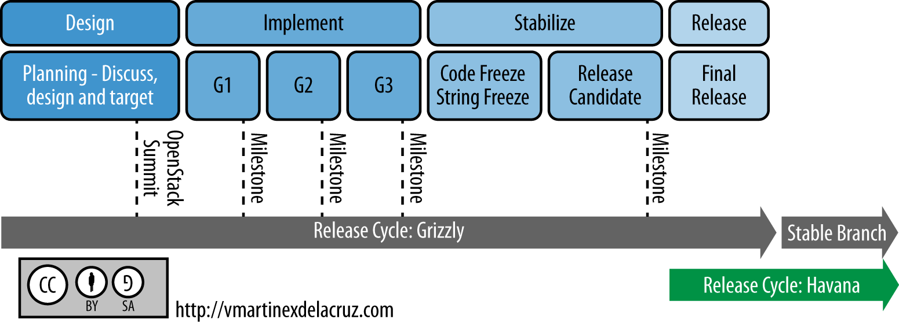

=====================
Working with Roadmaps
=====================

The good news: OpenStack has unprecedented transparency when it comes to
providing information about what's coming up. The bad news: each release
moves very quickly. The purpose of this appendix is to highlight some of
the useful pages to track, and take an educated guess at what is coming
up in the next release and perhaps further afield.

OpenStack follows a six month release cycle, typically releasing in
April/May and October/November each year. At the start of each cycle,
the community gathers in a single location for a Project Teams
Gathering (PTG). At the PTG, the features for the coming releases are
discussed, prioritized, and planned. The below figure shows an example
release cycle, with dates showing milestone releases, code freeze, and
string freeze dates, along with an example of when the summit occurs.
Milestones are interim releases within the cycle that are available as
packages for download and testing. Code freeze is putting a stop to
adding new features to the release. String freeze is putting a stop to
changing any strings within the source code.

Information Available to You
~~~~~~~~~~~~~~~~~~~~~~~~~~~~

There are several good sources of information available that you can use
to track your OpenStack development desires.

-  `List of OpenStack releases and release
   notes <https://releases.openstack.org/>`_

-  `A breakdown of current features under development, with their target
   milestone <https://status.openstack.org/release/>`_

-  `A list of all features, including those not yet under
   development <https://blueprints.launchpad.net/openstack>`_

-  `Rough-draft design discussions ("etherpads") from the last design
   summit <https://wiki.openstack.org/wiki/Summit/Kilo/Etherpads>`_

-  `List of individual code changes under
   review <https://review.openstack.org/>`_

Influencing the Roadmap
~~~~~~~~~~~~~~~~~~~~~~~

OpenStack truly welcomes your ideas (and contributions) and highly
values feedback from real-world users of the software. By learning a
little about the process that drives feature development, you can
participate and perhaps get the additions you desire.

Feature requests typically start their life in Etherpad, a collaborative
editing tool, which is used to take coordinating notes at a design
summit session specific to the feature. This then leads to the creation
of a blueprint on the Launchpad site for the particular project, which
is used to describe the feature more formally. Blueprints are then
approved by project team members, and development can begin.

Therefore, the fastest way to get your feature request up for
consideration is to create an Etherpad with your ideas and propose a
session to the PTG. If the PTG has already passed,
you may also create a blueprint directly. Read this `blog post about how
to work with blueprints
<http://vmartinezdelacruz.com/how-to-work-with-blueprints-without-losing-your-mind/>`_
the perspective of Victoria Martínez, a developer intern.

The roadmap for the next release as it is developed can be seen at
`Releases <https://releases.openstack.org>`_.

To determine the potential features going in to future releases, or to
look at features implemented previously, take a look at the existing
blueprints such as `OpenStack Compute (nova)
Blueprints <https://blueprints.launchpad.net/nova>`_, `OpenStack
Identity (keystone)
Blueprints <https://blueprints.launchpad.net/keystone>`_, and release
notes.

Aside from the direct-to-blueprint pathway, there is another very
well-regarded mechanism to influence the development roadmap:
the user survey. Found at `OpenStack User Survey
<https://www.openstack.org/user-survey/>`_,
it allows you to provide details of your deployments and needs, anonymously by
default. Each cycle, the user committee analyzes the results and produces a
report, including providing specific information to the technical
committee and project team leads.

Aspects to Watch
~~~~~~~~~~~~~~~~

You want to keep an eye on the areas improving within OpenStack. The
best way to "watch" roadmaps for each project is to look at the
blueprints that are being approved for work on milestone releases. You
can also learn from PTL webinars that follow the OpenStack summits twice
a year.

Driver Quality Improvements
---------------------------

A major quality push has occurred across drivers and plug-ins in Block
Storage, Compute, and Networking. Particularly, developers of Compute
and Networking drivers that require proprietary or hardware products are
now required to provide an automated external testing system for use
during the development process.

Easier Upgrades
---------------

One of the most requested features since OpenStack began (for components
other than Object Storage, which tends to "just work"): easier upgrades.
In all recent releases internal messaging communication is versioned,
meaning services can theoretically drop back to backward-compatible
behavior. This allows you to run later versions of some components,
while keeping older versions of others.

In addition, database migrations are now tested with the Turbo Hipster
tool. This tool tests database migration performance on copies of
real-world user databases.

These changes have facilitated the first proper OpenStack upgrade guide,
found in :doc:`ops-upgrades`, and will continue to improve in the next
release.

Deprecation of Nova Network
---------------------------

With the introduction of the full software-defined networking stack
provided by OpenStack Networking (neutron) in the Folsom release,
development effort on the initial networking code that remains part of
the Compute component has gradually lessened. While many still use
``nova-network`` in production, there has been a long-term plan to
remove the code in favor of the more flexible and full-featured
OpenStack Networking.

An attempt was made to deprecate ``nova-network`` during the Havana
release, which was aborted due to the lack of equivalent functionality
(such as the FlatDHCP multi-host high-availability mode mentioned in
this guide), lack of a migration path between versions, insufficient
testing, and simplicity when used for the more straightforward use cases
``nova-network`` traditionally supported. Though significant effort has
been made to address these concerns, ``nova-network`` was not be
deprecated in the Juno release. In addition, to a limited degree,
patches to ``nova-network`` have again begin to be accepted, such as
adding a per-network settings feature and SR-IOV support in Juno.

This leaves you with an important point of decision when designing your
cloud. OpenStack Networking is robust enough to use with a small number
of limitations (performance issues in some scenarios, only basic high
availability of layer 3 systems) and provides many more features than
``nova-network``. However, if you do not have the more complex use cases
that can benefit from fuller software-defined networking capabilities,
or are uncomfortable with the new concepts introduced, ``nova-network``
may continue to be a viable option for the next 12 months.

Similarly, if you have an existing cloud and are looking to upgrade from
``nova-network`` to OpenStack Networking, you should have the option to
delay the upgrade for this period of time. However, each release of
OpenStack brings significant new innovation, and regardless of your use
of networking methodology, it is likely best to begin planning for an
upgrade within a reasonable timeframe of each release.

As mentioned, there's currently no way to cleanly migrate from
``nova-network`` to neutron. We recommend that you keep a migration in
mind and what that process might involve for when a proper migration
path is released.

Distributed Virtual Router
~~~~~~~~~~~~~~~~~~~~~~~~~~

One of the long-time complaints surrounding OpenStack Networking was the
lack of high availability for the layer 3 components. The Juno release
introduced Distributed Virtual Router (DVR), which aims to solve this
problem.

Early indications are that it does do this well for a base set of
scenarios, such as using the ML2 plug-in with Open vSwitch, one flat
external network and VXLAN tenant networks. However, it does appear that
there are problems with the use of VLANs, IPv6, Floating IPs, high
north-south traffic scenarios and large numbers of compute nodes. It is
expected these will improve significantly with the next release, but bug
reports on specific issues are highly desirable.

Replacement of Open vSwitch Plug-in with Modular Layer 2
~~~~~~~~~~~~~~~~~~~~~~~~~~~~~~~~~~~~~~~~~~~~~~~~~~~~~~~~

The Modular Layer 2 plug-in is a framework allowing OpenStack Networking
to simultaneously utilize the variety of layer-2 networking technologies
found in complex real-world data centers. It currently works with the
existing Open vSwitch, Linux Bridge, and Hyper-V L2 agents and is
intended to replace and deprecate the monolithic plug-ins associated
with those L2 agents.

New API Versions
~~~~~~~~~~~~~~~~

The third version of the Compute API was broadly discussed and worked on
during the Havana and Icehouse release cycles. Current discussions
indicate that the V2 API will remain for many releases, and the next
iteration of the API will be denoted v2.1 and have similar properties to
the existing v2.0, rather than an entirely new v3 API. This is a great
time to evaluate all API and provide comments while the next generation
APIs are being defined. A new working group was formed specifically to
`improve OpenStack APIs <https://wiki.openstack.org/wiki/API_Working_Group>`_
and create design guidelines, which you are welcome to join.

OpenStack on OpenStack (TripleO)
~~~~~~~~~~~~~~~~~~~~~~~~~~~~~~~~

This project continues to improve and you may consider using it for
greenfield deployments, though according to the latest user survey
results it remains to see widespread uptake.

Data processing service for OpenStack (sahara)
~~~~~~~~~~~~~~~~~~~~~~~~~~~~~~~~~~~~~~~~~~~~~~

A much-requested answer to big data problems, a dedicated team has been
making solid progress on a Hadoop-as-a-Service project.

Bare metal Deployment (ironic)
~~~~~~~~~~~~~~~~~~~~~~~~~~~~~~

The bare-metal deployment has been widely lauded, and development
continues. The Juno release brought the OpenStack Bare metal drive into
the Compute project, and it was aimed to deprecate the existing
bare-metal driver in Kilo. If you are a current user of the bare metal
driver, a particular blueprint to follow is `Deprecate the bare metal
driver
<https://blueprints.launchpad.net/nova/+spec/deprecate-baremetal-driver>`_

Database as a Service (trove)
~~~~~~~~~~~~~~~~~~~~~~~~~~~~~

The OpenStack community has had a database-as-a-service tool in
development for some time, and we saw the first integrated release of it
in Icehouse. From its release it was able to deploy database servers out
of the box in a highly available way, initially supporting only MySQL.
Juno introduced support for Mongo (including clustering), PostgreSQL and
Couchbase, in addition to replication functionality for MySQL. In Kilo,
more advanced clustering capability was delivered, in addition to better
integration with other OpenStack components such as Networking.

Message Service (zaqar)
~~~~~~~~~~~~~~~~~~~~~~~

A service to provide queues of messages and notifications was released.

DNS service (designate)
~~~~~~~~~~~~~~~~~~~~~~~

A long requested service, to provide the ability to manipulate DNS
entries associated with OpenStack resources has gathered a following.
The designate project was also released.

Scheduler Improvements
~~~~~~~~~~~~~~~~~~~~~~

Both Compute and Block Storage rely on schedulers to determine where to
place virtual machines or volumes. In Havana, the Compute scheduler
underwent significant improvement, while in Icehouse it was the
scheduler in Block Storage that received a boost. Further down the
track, an effort started this cycle that aims to create a holistic
scheduler covering both will come to fruition. Some of the work that was
done in Kilo can be found under the `Gantt
project <https://wiki.openstack.org/wiki/Gantt/kilo>`_.

Block Storage Improvements
--------------------------

Block Storage is considered a stable project, with wide uptake and a
long track record of quality drivers. The team has discussed many areas
of work at the summits, including better error reporting, automated
discovery, and thin provisioning features.

Toward a Python SDK
-------------------

Though many successfully use the various python-\*client code as an
effective SDK for interacting with OpenStack, consistency between the
projects and documentation availability waxes and wanes. To combat this,
an `effort to improve the
experience <https://wiki.openstack.org/wiki/PythonOpenStackSDK>`_ has
started. Cross-project development efforts in OpenStack have a checkered
history, such as the `unified client
project <https://wiki.openstack.org/wiki/OpenStackClient>`_ having
several false starts. However, the early signs for the SDK project are
promising, and we expect to see results during the Juno cycle.
